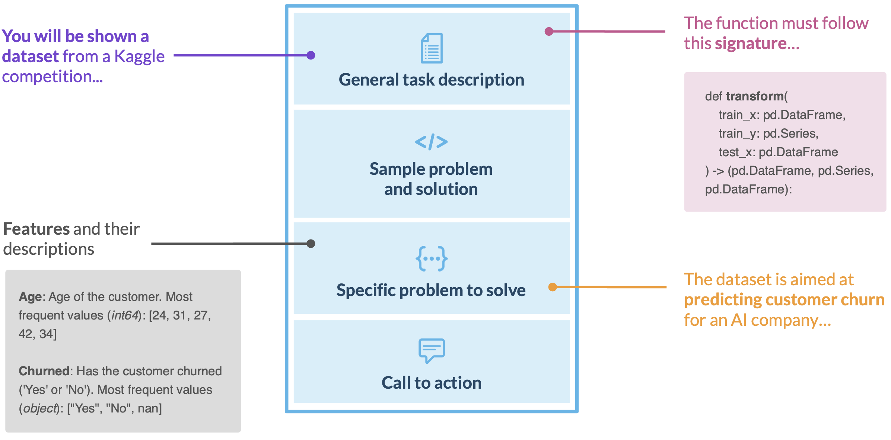

# FeatEng
The benchmark for LLMs designed to tackle one of the most knowledge-intensive tasks in data science: writing *feature engineering* code, which requires domain knowledge in addition to a deep understanding of the underlying problem and data structure. The method can cheaply and efficiently assess the broad capabilities of LLMs in contrast to the existing methods.

### Evaluation Setup
The model is provided with a dataset description in a prompt and asked to generate code transforming it. The evaluation score is derived from the improvement achieved by an XGBoost model fit on the modified dataset compared to the original data.



### Usage
(1) **Install** package with `pip`, e.g.:
```bash
pip install --upgrade "feateng @ git+https://github.com/FeatEng/FeatEng"
```
(2) **Run** evalution command. The most straightforward is to follow the following pattern:
```bash
feateng.evaluate --model [model_name]        \
                 --backend [hf|openai|vllm]  \
                 --greedy
```

Nevertheless, we recommend sampling several outputs and calculating scores as an average. This can be achieved with the `--temperature` and `--n_samples` parameters instead of `--greedy`.

### Examples
E.g., to obtain *gpt-4o-mini* scores comparable to these from the paper, use the following:
```bash
OPENAI_API_KEY="sk-..." feateng.evaluate --model "gpt-4o-mini-2024-07-18"  \
                                         --backend "openai"                \
                                         --temperature 1                   \
                                         --n_samples 3
```

For HuggingFace models, one can follow the following:
```bash
feateng.evaluate --model "mistralai/Codestral-22B-v0.1"     \
                 --backend "hf"                             \
                 --temperature 0.7                          \
                 --n_samples 3                              \
                 --attn_implementation "flash_attention_2"  \
```

### Implementation details
We rely heavily on the [EvalPlus](https://github.com/evalplus/evalplus) suite we extended to support FeatEng.
